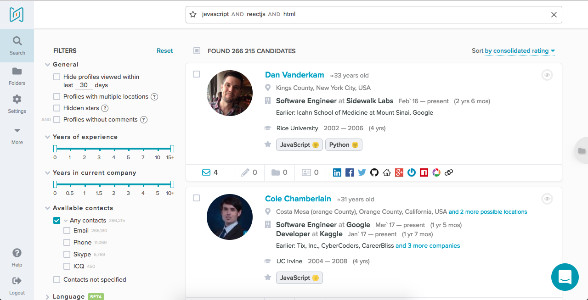

## Чем является AmazingHiring для клиентов?	
AmazingHiring - это поисковая платформа для рекрутмента. Она анализирует информацию о людях на основе открытых данных, собираемых со множества источников (GitHub, BitBucket, Stackoverflow, Kaggle, Linkedin, Facebook, Twitter, etc) и позволяет находить IT и Digital специалистов сразу по множеству критериев. Другими словами, она помогает ведущим компаниям на рынке находить лучших сотрудников. Нашим продуктов активно пользуются крупнейшие технологические компании в США, Германии, Нидерландах, Израиле, России, Украине и Белоруссии.	

Можешь посмотреть [видео-обзор системы](https://youtu.be/ORZG7Rha_Sk).

## Как устроен AmazingHiring	
AmazingHiring состоит из нескольких частей:	

- Frontend-1: JavaScript (React, Redux)	
- Frontend-2: Chrome extension	
- Middleware: Python (Django, Postgres)	
- Backend: Java.	

Стек используемых технологий на frontend:	
- React, Redux, Flux	
- HTML, JavaScript, CSS (БЭМ).	
- LESS, SASS, PostCSS.	
- Gulp, Webpack, Babel.	
- Git, gerrit, CI Jenkins.	

## Как устроен процесс разработки	
Работаем по Scrum, двухнедельные спринты, планирование спринта всей командой, синкапы через день.	
Раз в квартал планируются глобальные цели.	
Релизы бэкенда раз в 2 недели, релизы фронтенда по готовности.	

## Чем предстоит заниматься в период стажировки	
Уже в период стажировки тебе предстоит решать широкий спектр задач: от вёрстки, до разработки react-компонентов; от отладки и тестирования, до создания самостоятельных UI/UX-решений.	

Кроме вёрстки и программирования, также ты сможешь принять участие и в других цыклак разработки интерфейса:	
- поиск идей по развитию интерфейса;	
- сбор и аналитика продуктовых требований;	
- взаимодействие с feature-owner'ом, UI/UX-дизайнером и другими участниками рабочего процесс;	
- тестирование и сбор экспертного мнения о качестве выполненной работы;	

## Личные и профессиональные качества, которые помогут вам успешно проходить стажировку и работать в компании	

### Стремление к непрерывному повышению профессиональной компетенции.	
AmazingHiring является технически сложным программным продуктом с мировым рынком продаж и высокой конкурентностью. 	
Залогом для успешного развития такого продукта является непрерывное повышение профессиональной компетенции каждого из участников команды.	
Поэтому мы организовываем встречи по обмену опытом внутри коллектива, приглашаем экспертов из других компаний, способствуем и поощиряем посещение различных IT-мероприятий, чтение технической литературы и другие формы профессионального саморазвития.	

### Инициативность и креативность.	
Большинство возникающих задач потребуют от вас не только их формального исполнения в виде написания кода. Для успешного выполнения работы зачастую требуется проявлять творческий подход и смотреть на задачу с позиции product-owner'а, UI/UX-дизайнера, маркетолога и, конечно же, пользователя. 	

### Командность и ответственность.	
Процессы внутри AmazingHiring построены таким образом, что работа каждого непосредственным образом влияет на общий результат команды и успешность развития продукта в целом.	
Поэтому залогом достижения поставленных целей является ваше умение работать в команде и ваша ответственность.	

### Производительность и быстрота мышления.	
В стремлении быстро отреагировать на потребности наших клиентов  и даже предвосхитить их, необходимо умение максимально оперативно давать результат, при этом не теряя его качества. Будьте к этому готовы :)	

### Позитивность и стремление к лучшему.	
Главная задача нашей frontend-команды — получение позитивного пользовательского опыта. У нас это получается, потому что мы любим то чем занимаемся, мы команда и хотим делать только крутые интерфейсы!	

*Ты с нами?*
